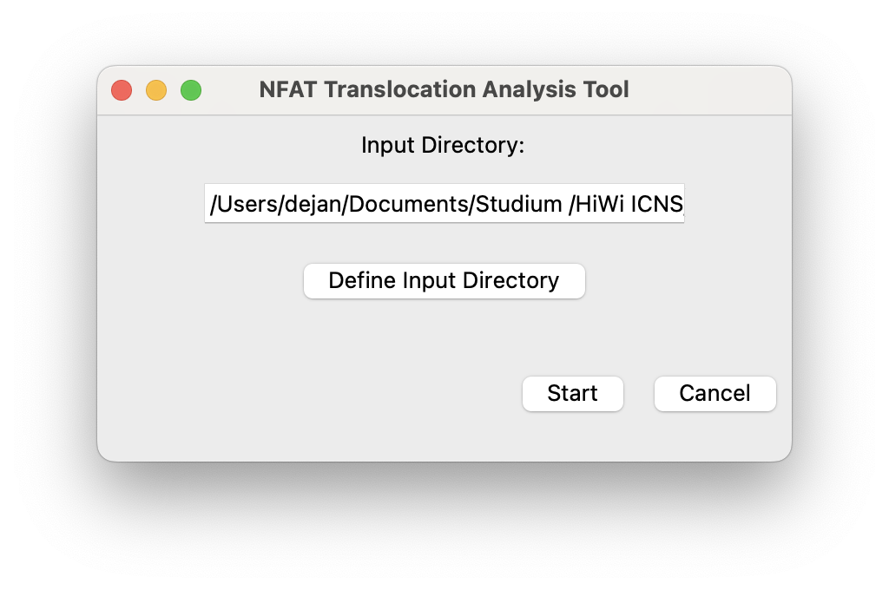
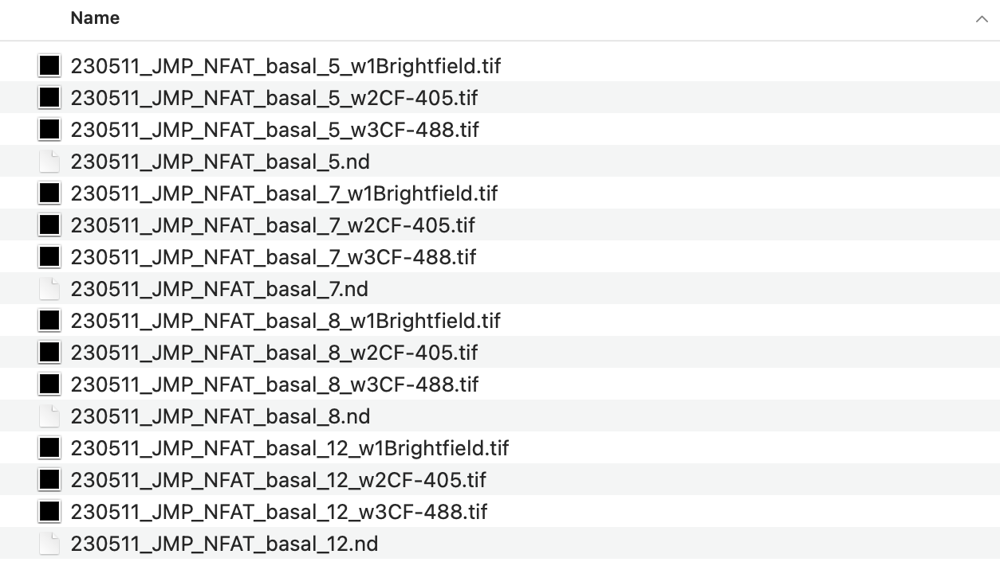
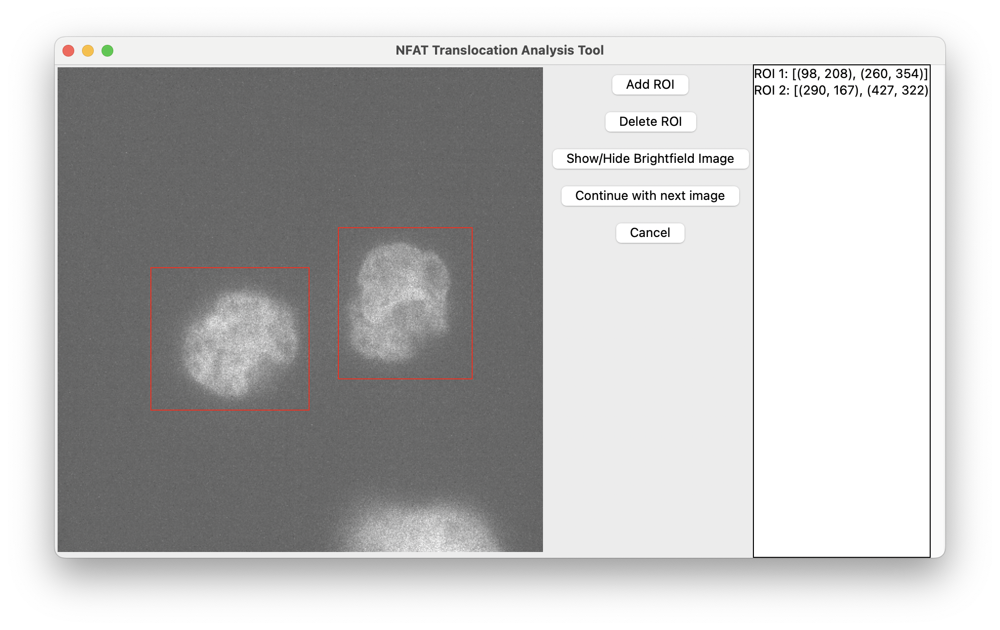
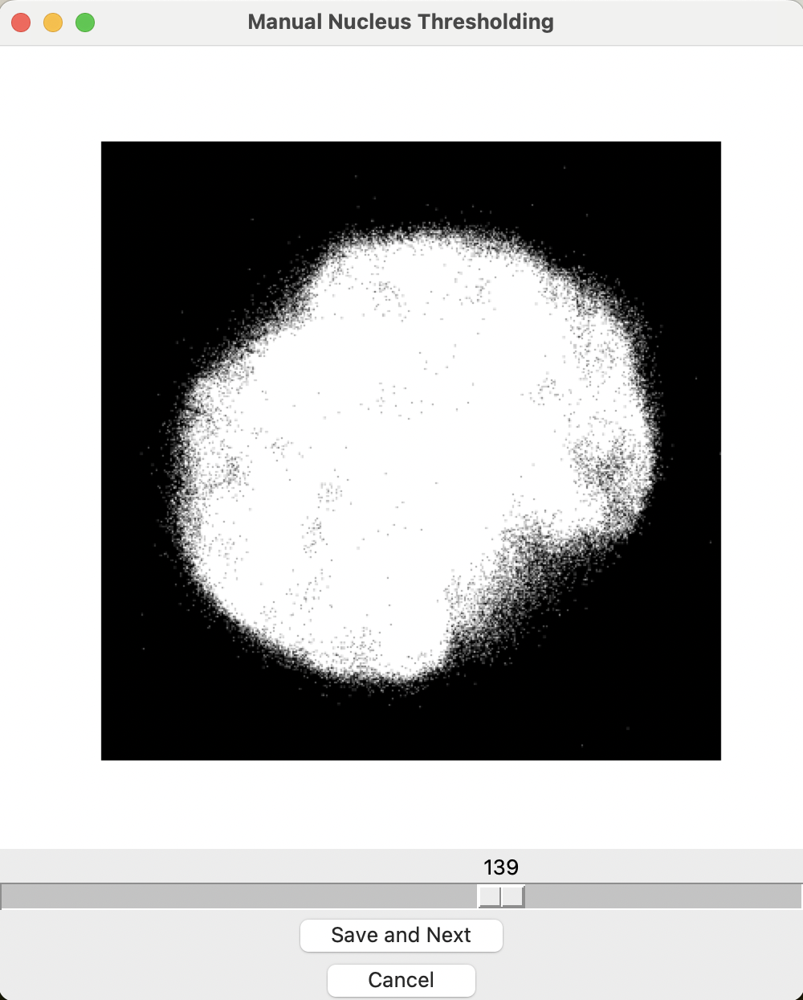
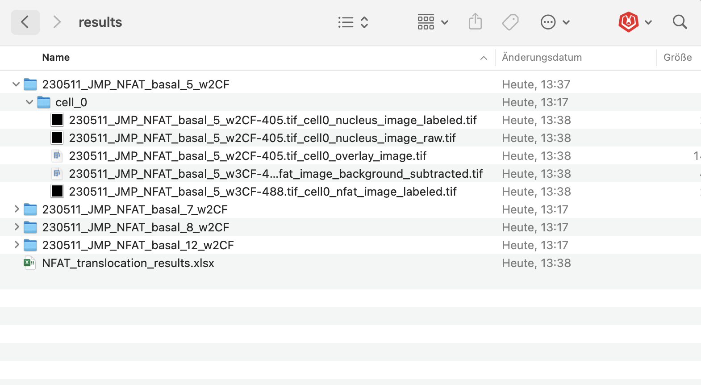
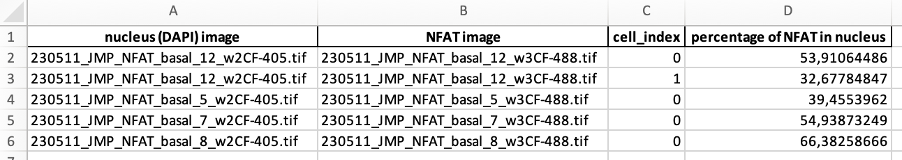
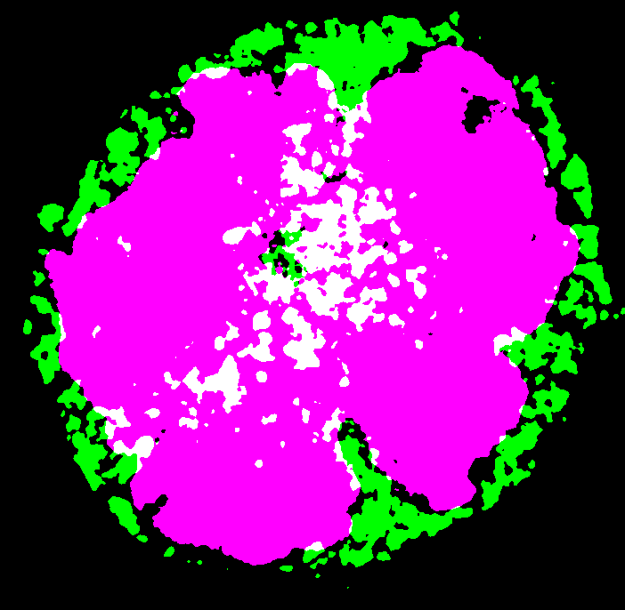

# NFAT translocation
[](https://zenodo.org/doi/10.5281/zenodo.10511337)

## About 
The NFAT Translocation Analysis Tool is a Python script designed for the quantitative analysis of NFAT (nuclear factor of activated T cells) translocation into the nucleus based on fluorescence microscopy images.


## Installation
1. If Python is already installed, skip to 3. Else: Install Python and IDE, see: [Youtube tutorial](https://www.youtube.com/watch?v=XQMUWhQusjo&t=1s) 
2. Install Anaconda on your computer, see [Anaconda download page](https://www.anaconda.com/download)
3. Navigate to the preferred folder for installation. Clone GitHub-Repository to local machine. You can accomplish this by typing 'git clone https://github.com/DejanKov2901/NFAT_translocation.git'. 
4. In the terminal window, create a conda environment NFAT with a specific python version: ```conda create --name NFAT python=3.10.0```
5. Activate the conda environment: ```conda activate NFAT```
6. Install the necessary packages and their dependencies by executing this command in the terminal:
```
pip install pandas tk scikit-image matplotlib numpy openpyxl
```
- Alternatively, install the packages separately (pip install <package>)


## How to Use
### Input Directory:
1. Activate the conda environment in the terminal by typing ```conda activate NFAT```, if it is not already activated.
2. Launch the tool by typing ```python3 main.py```. Make sure that you navigated to the NFAT folder on your computer using the cd-command.
2. Provide the path to the directory containing fluorescence microscopy images in the Graphical User Interface (GUI).


### Directory Structure:
Ensure that the image filenames follow a specific structure:
- File names should be identical for corresponding DAPI and NFAT images except for the suffix
  - In the example, the difference lies only in "w2CF-405" (for imaging of DAPI-stained nuclei) and "w3CF-488" (for NFAT-detection) (cameras from microscope) or in "w1Brightfield", respectively. This enables to match the corresponding files to each other.
- This is crucial for the correct function of the script! 



### Analysis:
- Press the "Start" button in the GUI to initiate the analysis.
- For each file, define rectangular regions of interest. 
  - click on "Add ROI"
  - to generate a ROI, click and release the left mouse button from the top left to the bottom right corner of the ROI, for example
  - repeat these steps for each cell in the file
  - If you're not sure that the ROI contains the whole cell, you can switch to the brightfield view.
  - If you're done with the file, click on "Continue with next image".



- Now you will be asked to manually threshold the nucleus and the NFAT area in all of the previously defined ROIs of this file.



- Once the thresholding of the nucleus and NFAT area are done for all cells, continue with the next file and define ROIs again. 

### Results Output:
After the analysis is completed, the tool generates a results table summarizing the percentage of NFAT translocation into the nucleus for each image pair.
You can find the results directory inside the original directory.

For each nucleus-NFAT image-pair, five images are generated: 
- labeled nucleus image
- raw but cropped nucleus image
- NFAT image (after background subtraction)
- labeled NFAT image
- RGB: overlay image (NFAT and nucleus)

To open these images in Fiji/ImageJ, use the bioformats importer. 




The Excel table looks like this, for example: 


### Example images:
#### overlay: nucleus in purple, NFAT in green.



## License
This code runs under the Apache 2.0 license.

## References and citing 
If you use code and this leads to a publication, please cite the DOI above.