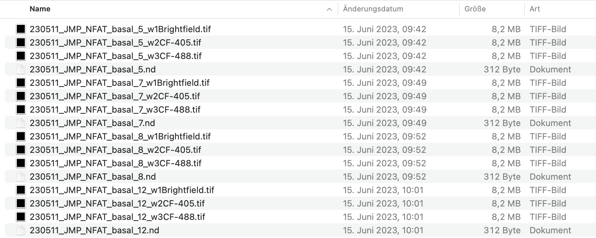
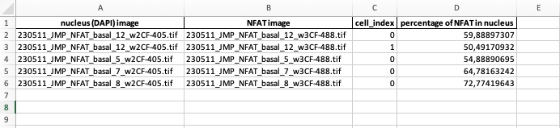

# NFAT translocation 
The NFAT Translocation Analysis Tool is a Python script designed for the quantitative analysis of NFAT (nuclear factor of activated T cells) translocation into the nucleus based on fluorescence microscopy images.

# Features

- Segmentation: Utilizes simple segmentation methods to identify nuclei and NFAT proteins in fluorescence microscopy images.
- Intersection Analysis: Calculates the intersection area between the segmented nuclei and NFAT regions, providing insights into NFAT translocation into the nucleus.
- Results Table: Generates a results table summarizing the percentage of NFAT inside the nucleus for each image pair (DAPI, NFAT).

# Installation
- Clone Github-Repository onto local machine
- Create a virtual environment (e.g. Conda)
- Install packages (TODO: yaml file)

# How to Use
### Input Directory:
1. Launch the tool and provide the path to the directory containing fluorescence microscopy images in the Graphical User Interface (GUI).

### Directory Structure:
Ensure that the image filenames follow a specific structure:
- File names should be identical for corresponding DAPI and NFAT images except for the suffix (405 for DAPI-stained nucleus, 488 for NFAT-detection)

### Start Analysis:
- Press the "Start" button in the GUI to initiate the analysis.
- The tool will automatically identify and pair corresponding DAPI and NFAT images based on the specified filename structure.

### Results Output:
After the analysis is complete, the tool generates a results table summarizing the percentage of NFAT translocation into the nucleus for each image pair.
Note: Users should ensure that the filenames are consistent and follow the specified structure for accurate analysis.

